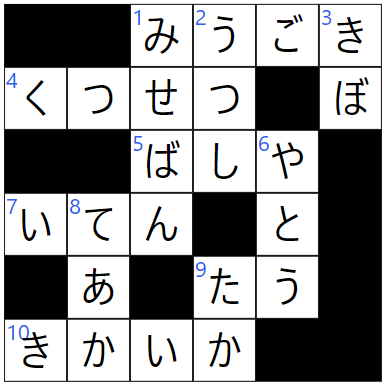
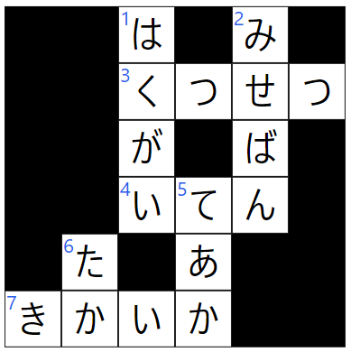

# Crossword Maker

与えられた単語リストからクロスワードを生成するプログラムです。

## 使用例

```
const config = new PuzzleConfig(12, 12, [
  'WordsNotAdjacentRule'
])
const data = CrosswordGenerator.generate(words, config)

```

## 生成されるクロスワードの例

### 密なパターン




### 単語非隣接ルールを適用


